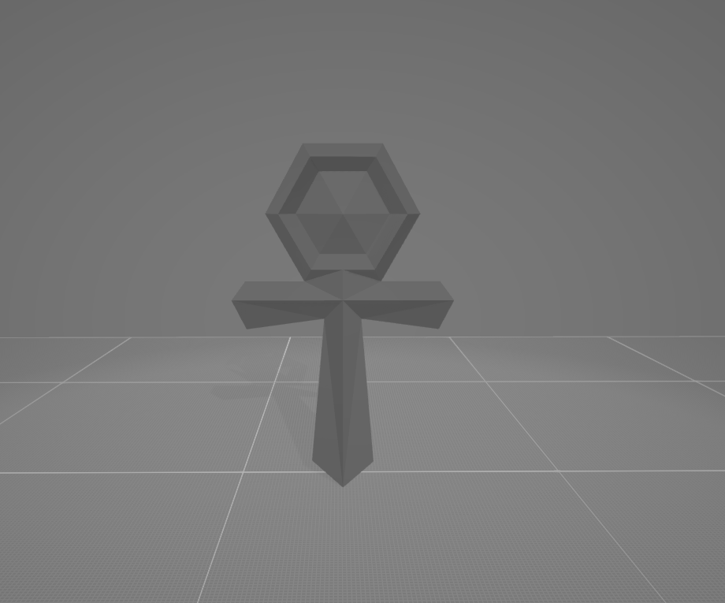

# 3D_to_GIF
<table>
  <tr>
    <td></td>
    <td></td>
    <td></td>
    <td></td>
    <td></td>
    <td></td>
    <td></td>
</table>
This tool imports a 3D model, rotates it within the scene, and exports it as a 2D frame animation in GIF or PNG format. Similar to the website imageotostl.
